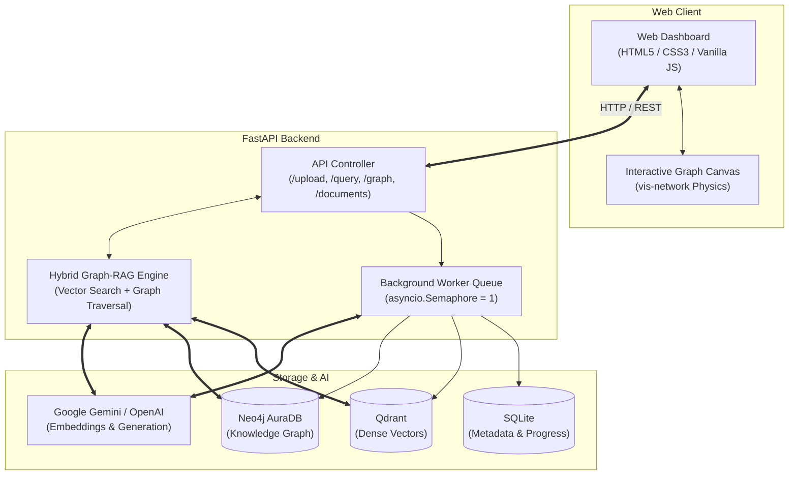
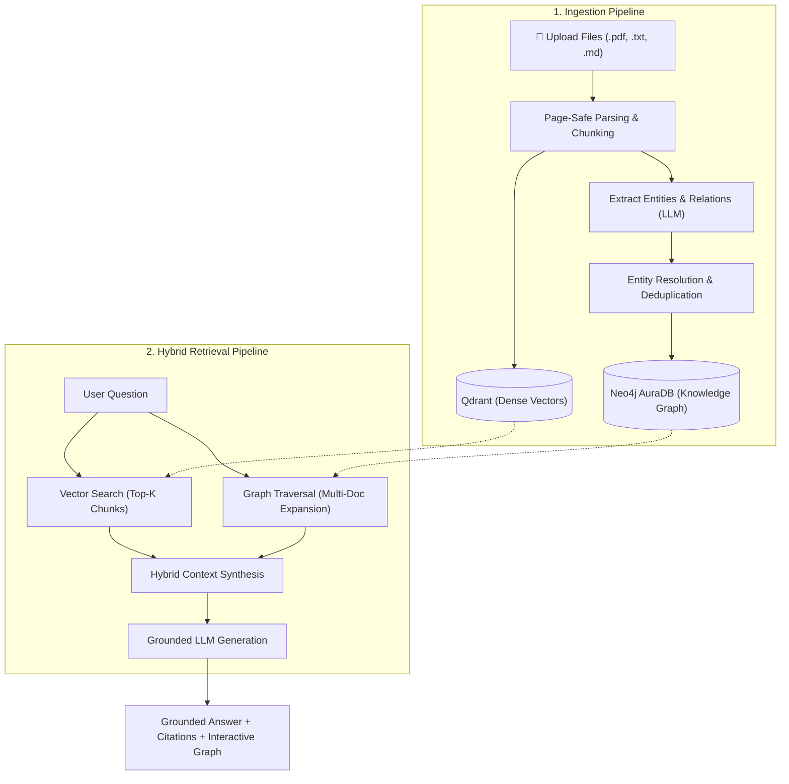

# GraphRAG — Knowledge Graph Enhanced Q&A

A high-performance **GraphRAG application** combining vector similarity search with knowledge graph reasoning, powered by **Neo4j AuraDB (Cloud)**, **embedded local Qdrant**, and a **modern HTML5/CSS3/Vanilla JS web dashboard** with interactive `vis-network` physics visualization.

[](https://github.com/yuvrajgovindrao/GraphRAG/actions/workflows/ci.yml)


---


## System Architecture

GraphRAG couples dense vector semantic search with structured knowledge graph traversal in a clean, modular architecture.



---

## End-to-End Workflow Flowchart

The system runs on two unified pipelines: **Document Ingestion** and **Balanced Hybrid Retrieval**.



---

##  Recent Updates & Changelog

- **Multi-File Batch Upload**: Select or drag-and-drop multiple `.pdf`, `.txt`, and `.md` files simultaneously. All files are enqueued and displayed immediately with individual status cards.
- **Real-Time Chunk Counter & Live Progress Bars**:
  - Document Library header badge shows total document and chunk counts across the library (`X docs · Y chunks`).
  - Active progress tracks display real-time status: `⏳ Parsing` (indeterminate animation) → `Extracting KG` (live `X/Y chunks (Z%)` counter) → ` Ready` (final chunk count badge).
- **Fault-Tolerant Pipeline Concurrency (`asyncio.Semaphore`)**:
  - Background ingestion worker processes documents sequentially, eliminating Gemini API `429 RESOURCE_EXHAUSTED` rate limits and SQLite database write locks.
  - Per-page parser resilience catches corrupted PDF pages individually without failing the overall document.
- **Balanced Multi-Document Graph Expansion**:
  - Solved knowledge graph starvation on cross-document compound questions.
  - Integrated `find_entities_by_chunk_ids()` and Neo4j 5 `CALL (start) { ... }` subqueries to guarantee that every document retrieved by vector search receives an equal, rich share of graph facts and nodes on the canvas.
- **Full Cross-Document Knowledge Graph (`/graph/global`)**:
  - Added dedicated endpoint and dropdown selector to explore the entire connected knowledge graph across all uploaded documents.
  - Guaranteed endpoint integrity ensures 100% of relationship source/target nodes are rendered with zero broken links.
- **Visual Graph & Layout Polish**:
  - **Expandable Square View**: "Expand Graph" button switches to a full-width `95vh` square layout for wide-canvas graph exploration.
  - **Stable Centering**: View initializes centered upon render; removed delayed snap-back auto-fits.
  - **Standardized Header Heights**: Unified all panel headers to `62px`.
  - **Safe Error Handling**: Replaced strict JSON parsing with adaptive error decoding, preventing `Unexpected token 'I'` exceptions and displaying human-readable root causes directly in the UI.

---

## Features

- **Zero-Docker Architecture**: Vector search runs in-process via embedded Qdrant (`data/qdrant_db`) and Knowledge Graph connects to Neo4j AuraDB Cloud.
- **Multi-File Batch Upload & Live Progress**: Select or drag-and-drop multiple documents simultaneously with live extraction progress bars, chunk counts, and status tracking.
- **Fault-Tolerant Concurrency Control**: Sequential pipeline semaphore prevents Gemini 429 quota exhaustion and SQLite lock contention; per-page parser resilience ensures damaged pages don't crash whole documents.
- **Batched AuraDB Operations**: Ultra-fast `UNWIND` Cypher batching (100+ entities merged in <1.5s) with guaranteed endpoint consistency and zero broken edges.
- **Global & Document Subgraphs**: View individual document graphs or inspect the entire connected Knowledge Graph across all uploaded documents.
- **Interactive Force-Directed Physics Arena**: Built with `vis-network` (tactile Barnes-Hut elasticity, straight arrow edges, expand-to-square full view, node inspector, and auto-centering).
- **Hybrid Retrieval Modes**: Easily toggle between **Graph-Enhanced** and **Vector-Only** Q&A modes.
- **Transparent Source Citations**: Collapsible source passages with exact filenames, page numbers, and relevance scores.
- **Cascade Deletion**: Cleanly delete documents with automatic cascading removal from SQLite, Qdrant vectors, and Neo4j graph nodes.

---

## Quick Start

### 1. Clone & Setup

```bash
git clone https://github.com/yuvrajgovindrao/GraphRAG.git
cd GraphRAG

# Create and activate virtual environment
python -m venv .venv

# Windows PowerShell 
.venv\Scripts\activate

#if you get a script execution policy error,
#First run this once: Set-ExecutionPolicy -ExecutionPolicy RemoteSigned -Scope CurrentUser

# Linux / macOS
source .venv/bin/activate

# Install dependencies
pip install -r requirements.txt
```

### 2. Configure Environment

Copy `.env.example` to `.env` and fill in your keys:

```bash
copy .env.example .env      # Windows
# cp .env.example .env      # Linux / macOS
```

Edit `.env`:
```env
# LLM Provider ("gemini" or "openai")
LLM_PROVIDER=gemini
GEMINI_API_KEY=your_gemini_api_key_here

# Neo4j AuraDB (Cloud)
NEO4J_URI=neo4j+s://<your-instance-id>.databases.neo4j.io
NEO4J_USER=neo4j
NEO4J_PASSWORD=your_auradb_password
```

> [!TIP]
> **SSL Certificate / Firewall Issue (`+s` vs `+ssc`):**
> If you get `[SSL: CERTIFICATE_VERIFY_FAILED]` or `Unable to retrieve routing information` (common on college/office Wi-Fi, VPNs, or antivirus software with HTTPS scanning), change `neo4j+s://` to **`neo4j+ssc://`** in your `.env`:
> ```env
> NEO4J_URI=neo4j+ssc://<your-instance-id>.databases.neo4j.io
> ```
> `+ssc` enables encryption while accepting self-signed or proxy-intercepted certificates in the network chain.

### 3. Run the Application

Start the FastAPI server directly with Uvicorn:

```bash
uvicorn backend.main:app --reload --host 127.0.0.1 --port 8000
```

> [!TIP]
> You can also run directly without activating the virtual environment:
> ```bash
> .venv\Scripts\uvicorn.exe backend.main:app --reload --host 127.0.0.1 --port 8000
> ```

### 4. Open the Web Dashboard

Open your browser and navigate to:
- **Web Dashboard**: [http://localhost:8000](http://localhost:8000)
- **Interactive API Docs**: [http://localhost:8000/docs](http://localhost:8000/docs)

> [!IMPORTANT]
> Always visit **[http://localhost:8000](http://localhost:8000)** (or **http://127.0.0.1:8000**) in your web browser.
> *(Do not type `0.0.0.0` in browser address bars as browsers cannot resolve `0.0.0.0`).*

### 5. Run Tests

```bash
pytest -v
```

---

##  API Endpoints

| Method | Endpoint | Description |
|---|---|---|
| `GET` | `/health` | Service connectivity status (AuraDB, Qdrant, SQLite, LLM) |
| `POST` | `/upload` | Upload one or multiple PDF, TXT, or MD files for background ingestion |
| `GET` | `/documents` | List all uploaded documents with status and chunk counts |
| `GET` | `/documents/{id}` | Get document metadata |
| `GET` | `/documents/{id}/status` | Poll ingestion & extraction chunk progress |
| `GET` | `/documents/{id}/chunks` | Inspect document chunks and page mappings |
| `DELETE` | `/documents/{id}` | Cascade delete document, vectors, and graph entities |
| `POST` | `/query` | Ask questions in `graph` or `vector` mode |
| `GET` | `/graph/summary` | Knowledge graph entity and relationship counts |
| `GET` | `/graph/document/{id}` | Subgraph nodes and edges for a specific document |
| `GET` | `/graph/global` | Entire connected knowledge graph across all uploaded documents |
| `POST` | `/evaluate` | Run evaluation suite comparing retrieval modes |

---

## Project Structure

```
graphrag-app/
├── backend/
│   ├── config.py             # Pydantic Settings & environment config
│   ├── database.py           # SQLite metadata layer
│   ├── models.py             # Pydantic request/response models
│   ├── llm_provider.py       # Asynchronous Gemini & OpenAI provider
│   ├── main.py               # FastAPI application & static file mount
│   ├── ingestion/
│   │   ├── parser.py         # PyMuPDF document parser
│   │   └── chunker.py        # SentenceSplitter chunker with page tracking
│   ├── extraction/
│   │   ├── prompts.py        # Entity & relationship extraction prompts
│   │   └── extractor.py      # Async batch extraction engine
│   ├── graph/
│   │   ├── neo4j_client.py   # Neo4j AuraDB client with UNWIND batching
│   │   ├── entity_resolution.py # Entity deduplication & normalization
│   │   └── traversal.py      # Bidirectional graph expansion
│   ├── retrieval/
│   │   ├── vector_search.py  # Local embedded Qdrant vector engine
│   │   └── graph_rag.py      # Hybrid graph-enhanced retrieval
│   └── evaluation/
│       └── evaluator.py      # Evaluation & benchmarking runner
├── frontend/
│   ├── index.html            # Single-Page web dashboard
│   ├── css/
│   │   └── style.css         # Modern dark glassmorphic styling
│   └── js/
│       └── app.js            # App logic & vis-network graph renderer
├── tests/
│   └── test_api.py           # Pytest suite (health, validation, chunker, models)
├── data/
│   └── raw/                  # Uploaded document storage
├── eval/
│   └── test_questions.json   # Evaluation test set
├── .env.example              # Environment variables template
├── .gitignore                # Git ignore rules
├── requirements.txt          # Python dependencies
└── README.md                 # Project documentation
```

---

## Troubleshooting

### Neo4j AuraDB Connection Issues

| Issue | Cause | Solution |
|---|---|---|
| `[SSL: CERTIFICATE_VERIFY_FAILED]` or `self-signed certificate in certificate chain` | Antivirus (Bitdefender, Kaspersky, Avast) or institutional Wi-Fi intercepting SSL certificates with local certs. | Change `neo4j+s://` to **`neo4j+ssc://`** in `.env`. |
| `Unable to retrieve routing information` | Port 7687 blocked by firewall/VPN or AuraDB instance is paused. | 1. Resume instance in [Aura Console](https://console.neo4j.io/).<br>2. Try `NEO4J_URI=bolt+ssc://<id>.databases.neo4j.io:7687`. |
| `ModuleNotFoundError: No module named '...'` | Virtual environment not activated or packages not installed. | Run `.venv\Scripts\activate` then `pip install -r requirements.txt`. |

